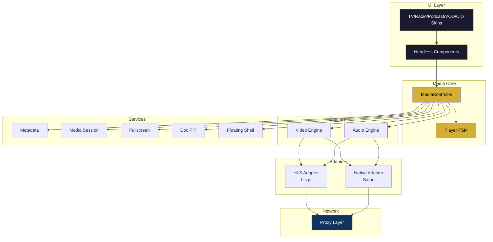

# Media Engine — Especificação

> Especificação (não implementação) do núcleo de reprodução multimídia compartilhado entre TV, Rádio, Podcasts, VOD, Clips.
> Complementa [`PLAYER_FUTURE_ARCHITECTURE.md`](./PLAYER_FUTURE_ARCHITECTURE.md).

---

## 1. Objetivo

Um Media Engine único que:
- Reduz duplicação entre players (>70% do código hoje é comum).
- Padroniza FSM, eventos, cleanup, cache, proxy.
- Adiciona features transversais uma única vez (Media Session, Doc PiP, Chromecast).
- Preserva liberdade de UI por superfície (TV, Rádio, Podcast, VOD, Clip têm skins distintas).

---

## 2. Módulos

### 2.1 Media Core
API pública, contratos, tipos.

```ts
export type MediaStatus = 'idle' | 'loading' | 'playing' | 'paused' | 'error' | 'ended'
export type MediaKind = 'live-video' | 'live-audio' | 'vod-video' | 'vod-audio' | 'clip'

export interface MediaSource {
  url: string                     // proxy URL
  kind: MediaKind
  poster?: string
  metadata?: MediaMetadataInit
  hlsOptions?: Partial<HlsConfig>
}

export interface MediaController {
  play(): Promise<void>
  pause(): void
  toggle(): void
  seek(seconds: number): void       // VOD only
  setVolume(v: number): void
  setMuted(m: boolean): void
  destroy(): void

  readonly status: MediaStatus
  readonly duration: number         // Infinity para live
  readonly currentTime: number
  readonly buffered: TimeRanges

  on(event: 'statuschange' | 'timeupdate' | 'error' | 'ended', cb: Fn): Unsubscribe
}

export function createMediaController(el: HTMLMediaElement, source: MediaSource): MediaController
```

### 2.2 HLS Adapter
Abstrai `hls.js` × HLS nativo (Safari).

```ts
export interface StreamAdapter {
  attach(el: HTMLMediaElement): void
  detach(): void
  on(event: 'error' | 'levels' | 'stats', cb: Fn): Unsubscribe
}

export function createHlsAdapter(url: string, opts?: HlsConfig): Promise<StreamAdapter>
// - se Hls.isSupported() → hls.js
// - else if canPlayType(mpegurl) → adapter fino que só seta video.src
// - else → throw NotSupported
```

### 2.3 Audio Engine / Video Engine
Wrappers finos em torno de `<audio>` e `<video>` que padronizam eventos e cleanup. Compartilham 90% da lógica via `HTMLMediaElement`.

### 2.4 Metadata Service
```ts
export interface MetadataService {
  fromID3(el: HTMLMediaElement): Observable<TrackMetadata>          // rádio/podcast
  fromManifest(hls: Hls): Observable<StreamMetadata>                 // VOD/live
  fromCues608(el: HTMLVideoElement): Observable<CaptionCue>          // legendas
  merge(...sources: Observable<Metadata>[]): Observable<Metadata>
}
```

### 2.5 Media Session Service
```ts
export function bindMediaSession(controller: MediaController, meta: MediaMetadataInit): Unbind
// - navigator.mediaSession.metadata = new MediaMetadata(meta)
// - setActionHandler('play'|'pause'|'stop'|'seekbackward'|'seekforward'|...)
// - unbind no destroy
```

### 2.6 Floating Player
```tsx
<FloatingShell
  dockable         // pode voltar ao inline
  draggable
  positions={['bottom-right', 'bottom-left', 'top-right', 'top-left']}
  minimized
  onDock={fn}
  onClose={fn}
>
  {children}
</FloatingShell>
```

### 2.7 Document Picture-in-Picture
Enhancement progressivo (Chrome ≥116).

```ts
export async function openDocumentPip(node: HTMLElement): Promise<Window> | null
// window.documentPictureInPicture?.requestWindow(...)
// null se API indisponível → fallback: FloatingShell
```

### 2.8 Fullscreen Manager
```ts
export function createFullscreenManager(target: HTMLElement): {
  toggle(): void
  readonly isFullscreen: boolean
  on(event: 'change', cb: Fn): Unsubscribe
}
// abstrai vendor prefixes + iOS Safari (usa webkitEnterFullscreen no <video>)
```

### 2.9 Player State Manager (FSM)
Máquina de estados canônica. Ver [`PLAYER_ARCHITECTURE.md § 5.5`](./PLAYER_ARCHITECTURE.md).

```ts
type PlayerState = 'idle' | 'loading' | 'playing' | 'paused' | 'error' | 'ended'
type PlayerEvent = 'activate' | 'play' | 'pause' | 'error' | 'retry' | 'end' | 'waiting'

export function createPlayerFSM(): FSM<PlayerState, PlayerEvent>
```

### 2.10 UI Components
Headless + Skinned.

Headless: `<MediaProvider>`, `<PlayPauseButton>`, `<MuteButton>`, `<VolumeSlider>`, `<Timeline>`, `<QualityMenu>`, `<StatusIndicator>`, `<FullscreenButton>`.

Skinned: `<TVSkin>`, `<RadioSkin>`, `<PodcastSkin>`, `<VODSkin>`, `<ClipSkin>`.

### 2.11 Proxy Layer
Server routes reutilizáveis:

```text
/api/public/media/{provider}/*
  onde provider ∈ { hls, radio, podcast, vod }
```

Configuração via allow-list:

```ts
const PROVIDERS: Record<string, { origin: string, kinds: MediaKind[] }> = {
  hls:     { origin: "https://tv.fazenda.rodeo/hls/",             kinds: ['live-video'] },
  radio:   { origin: "https://live.fazenda.rodeo/hls/country/",   kinds: ['live-audio'] },
  podcast: { origin: "https://cdn.fazenda.rodeo/podcasts/",       kinds: ['vod-audio'] },
  vod:     { origin: "https://cdn.fazenda.rodeo/vod/",            kinds: ['vod-video'] },
}
```

---

## 3. Diagrama de módulos



---

## 4. Contratos de estabilidade

| Módulo | Nível | Breaking changes? |
|---|---|---|
| Media Core (API pública) | Estável (semver-major) | Requer ADR |
| HLS Adapter | Interno | Livre para refatorar |
| Native Adapter | Interno | Livre para refatorar |
| Services | Estável (opt-in) | Semver-minor |
| UI Headless | Estável (props) | Requer ADR |
| UI Skins | Instável | Livre |
| Proxy Layer (URLs) | Estável | Requer ADR |

---

## 5. Fora do escopo

- ❌ DRM (Widevine/FairPlay/PlayReady) — futuro V3.
- ❌ WebRTC — plataforma é HLS-first.
- ❌ MSE customizado — hls.js resolve.
- ❌ ABR customizado — hls.js resolve.
