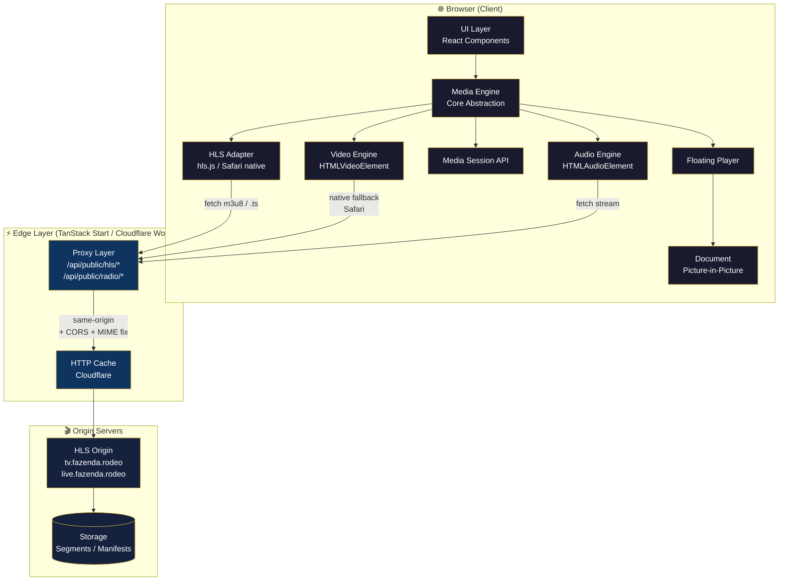

# Arquitetura da Plataforma de Mídia

> Diagrama global da plataforma de mídia da Fazenda Rodeo — do browser ao storage.

---

## 1. Diagrama Mermaid



## 2. Diagrama ASCII

```text
┌──────────────────────────── Browser (Client) ─────────────────────────────┐
│                                                                           │
│   ┌─────────────────────────────────────────────────────────────────┐     │
│   │                      UI Layer (React)                           │     │
│   │  TVSkin · RadioSkin · PodcastSkin · VODSkin · ClipSkin          │     │
│   └───────────────────────────────┬─────────────────────────────────┘     │
│                                   │                                       │
│   ┌───────────────────────────────▼─────────────────────────────────┐     │
│   │                    Media Engine (Core)                          │     │
│   │  Controller · FSM · Services (MediaSession, Fullscreen, PiP)    │     │
│   └───────┬────────────────┬────────────────┬─────────────────┬─────┘     │
│           │                │                │                 │           │
│    ┌──────▼──────┐  ┌──────▼──────┐  ┌──────▼──────┐  ┌───────▼──────┐    │
│    │ Video Eng.  │  │ Audio Eng.  │  │ HLS Adapter │  │ Floating +   │    │
│    │ <video>     │  │ <audio>     │  │ hls.js /    │  │ Document PiP │    │
│    │             │  │             │  │ Safari nat. │  │              │    │
│    └──────┬──────┘  └──────┬──────┘  └──────┬──────┘  └──────────────┘    │
└───────────┼────────────────┼────────────────┼─────────────────────────────┘
            │                │                │
            │      HTTP (same-origin, CORS, Range)
            ▼                ▼                ▼
┌────────────────────── Edge Layer (Worker) ────────────────────────────────┐
│                                                                           │
│   ┌───────────────────────────────────────────────────────────────┐       │
│   │  Proxy Layer                                                  │       │
│   │  /api/public/hls/*   /api/public/radio/*                      │       │
│   │  • CORS  • MIME fix  • Range forward  • streaming             │       │
│   └───────────────────────────────┬───────────────────────────────┘       │
│                                   │                                       │
│   ┌───────────────────────────────▼───────────────────────────────┐       │
│   │  HTTP Cache (Cloudflare edge)                                 │       │
│   └───────────────────────────────┬───────────────────────────────┘       │
└───────────────────────────────────┼───────────────────────────────────────┘
                                    │
                                    ▼
┌───────────────────────── Origin Servers ──────────────────────────────────┐
│                                                                           │
│   tv.fazenda.rodeo/hls/     live.fazenda.rodeo/hls/country/               │
│                                   │                                       │
│                                   ▼                                       │
│              ┌──────────────────────────────────┐                         │
│              │   Storage (segments + manifests) │                         │
│              └──────────────────────────────────┘                         │
└───────────────────────────────────────────────────────────────────────────┘
```

## 3. Responsabilidade de cada camada

| Camada | Responsabilidade | Contratos |
|---|---|---|
| **UI Layer** | Render, interação, skin por superfície | Props/hooks do Media Engine |
| **Media Engine** | Orquestração, FSM, ciclo de vida | `MediaController` (ver [`MEDIA_ENGINE.md`](./MEDIA_ENGINE.md)) |
| **Video/Audio Engine** | Wrapper de `HTMLMediaElement` | Eventos DOM padrão |
| **HLS Adapter** | `hls.js` × HLS nativo | `StreamAdapter` interface |
| **Media Session** | Metadata para SO/lockscreen | Media Session API |
| **Floating / PiP** | Container flutuante e Doc PiP | Componentes headless |
| **Proxy Layer** | CORS, MIME, Range, streaming | HTTP público (ver [`API_REFERENCE.md`](./API_REFERENCE.md)) |
| **Cache** | Edge cache respeitando `Cache-Control` | Cloudflare rules |
| **Origin** | Servir HLS bruto | HTTP/HTTPS |
| **Storage** | Persistir segmentos e manifests | Interno ao origin |

---

## 4. Fronteiras de contrato

- **Client ↔ Edge:** HTTP público, `/api/public/*`, sem auth, CORS `*`. Ver [`API_REFERENCE.md`](./API_REFERENCE.md).
- **Edge ↔ Origin:** HTTP interno via `fetch()`. Origin fixo em constante. Ver [`SECURITY.md § 8`](./SECURITY.md#8-ssrf).
- **UI ↔ Media Engine:** Interfaces TypeScript versionadas por semver. Ver [`MEDIA_ENGINE.md § 4`](./MEDIA_ENGINE.md).

---

## 5. Escopo

Esta arquitetura suporta hoje:
- ✅ TV Live (HLS de vídeo)
- ✅ Rádio Live (HLS de áudio)

E, com o Media Engine (futuro):
- 🔜 Podcasts (VOD de áudio)
- 🔜 VOD (vídeo sob demanda)
- 🔜 Clips / Shorts
- 🔜 Lives interativas
- 🔜 Qualquer novo player que siga o baseline
