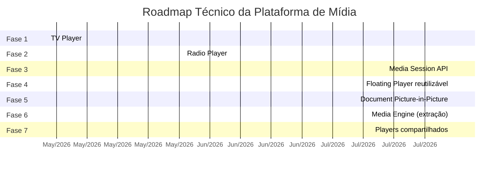
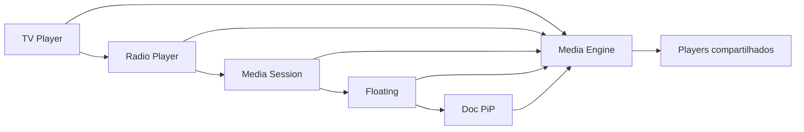

# Roadmap dos Players

> Roadmap funcional (features por player) e roadmap técnico (fases arquiteturais).

---

## Parte A — Roadmap Funcional

### TV Player

| Feature | Prioridade | Complexidade | Dependências | Notas |
|---|---|---|---|---|
| Autoplay muted | ✅ MVP | Baixa | — | Implementado |
| Lazy activation | ✅ MVP | Baixa | IntersectionObserver | Implementado |
| Retry manual | ✅ MVP | Baixa | — | Implementado |
| Fullscreen | ✅ MVP | Baixa | Fullscreen API | Implementado |
| Mute/Unmute | ✅ MVP | Baixa | — | Implementado |
| **Floating Player** | V2 | Média | `<FloatingShell>` (Media Engine) | Migrar UX após rádio |
| **Picture-in-Picture (vídeo)** | V2 | Média | `requestPictureInPicture()` API | Chrome, Edge, Safari 13.1+ |
| **Chromecast** | V3 | Alta | Cast SDK, receiver app | Requer conta Developer |
| **AirPlay** | V3 | Alta | `x-webkit-airplay="allow"` + edge auth | Safari macOS/iOS |
| **DVR (rewind na live)** | V3 | Alta | Manifesto com DVR window | Depende do origin |
| **ABR automática** | ✅ MVP | Baixa | `hls.js` default | Já ativo |
| **Legendas (WebVTT/608)** | V2 | Média | Tracks no manifesto ou lateral | Requer produção |

### Radio Player

| Feature | Prioridade | Complexidade | Dependências | Notas |
|---|---|---|---|---|
| Sticky floating | ✅ MVP | Baixa | — | Implementado |
| Status indicator | ✅ MVP | Baixa | — | Implementado |
| Metadata ID3 | ✅ MVP | Média | — | Implementado (best-effort) |
| **Media Session API** | V2 | Média | Navigator.mediaSession | Lockscreen + Bluetooth |
| **Floating avançado (dockable)** | V2 | Média | `<FloatingShell>` | Reutilizável |
| **Document PiP** | V3 | Alta | `documentPictureInPicture` | Chrome 116+ |
| **PWA offline shell** | V2 | Média | Service Worker | Não a stream |
| **Equalizador** | V3 | Alta | Web Audio API | Impacto de CPU |
| **Favoritos** | V2 | Média | localStorage / conta | Persistência |
| **Histórico** | V2 | Média | localStorage | Últimas N faixas |
| **Compartilhamento** | V2 | Baixa | Web Share API | Fallback: copy link |
| **Sleep Timer** | V2 | Baixa | setTimeout + fade | UX comum em rádios |

### Podcasts (futuro)

| Feature | Prioridade | Notas |
|---|---|---|
| Reprodução VOD áudio | V2 | Base do Rádio + seek |
| Velocidade (0.5x-2x) | V2 | `playbackRate` |
| Marcadores/capítulos | V3 | Manifesto ou sidecar |
| Download offline | V3 | Service Worker + IndexedDB |

### VOD (futuro)

| Feature | Prioridade | Notas |
|---|---|---|
| Reprodução VOD vídeo | V2 | HLS VOD manifest |
| Seek/timeline | V2 | Range requests já suportadas |
| Thumbnails na timeline | V3 | Sprite + WebVTT |
| Continuar assistindo | V3 | localStorage + backend |

### Clips / Shorts (futuro)

| Feature | Prioridade | Notas |
|---|---|---|
| MP4 curto autoplay | V2 | Sem hls.js |
| Loop | V2 | `loop` attribute |
| Swipe vertical | V2 | UI custom |

---

## Parte B — Roadmap Técnico (fases arquiteturais)

### Detalhamento das fases

| Fase | Escopo | Entregáveis | Depende de |
|---|---|---|---|
| **1 — TV Player** | HLS Live vídeo + proxy | `LivePlayer.tsx`, `hls.$.ts` | — |
| **2 — Radio Player** | HLS Live áudio + proxy | `RadioPlayer.tsx`, `radio.$.ts` | Fase 1 (padrão de proxy) |
| **3 — Media Session** | Metadata OS/lockscreen | `bindMediaSession()` service | Fase 2 |
| **4 — Floating Player** | `<FloatingShell>` reutilizável | Componente headless + skin | Fase 3 |
| **5 — Document PiP** | Enhancement progressivo | `openDocumentPip()` service | Fase 4 |
| **6 — Media Engine** | Extração de núcleo compartilhado | Hooks, adapters, controller | Fases 1-5 |
| **7 — Player compartilhado** | TV, Rádio, Podcast, VOD, Clips no mesmo core | Skins por superfície + backend | Fase 6 |

### Dependências

---

## Governança

- Cada fase deve gerar (ou atualizar) ADRs em [`adr/`](./adr/).
- Divergências do baseline em [`REFERENCE_ARCHITECTURE.md`](./REFERENCE_ARCHITECTURE.md) exigem ADR.
- Cada release passa pelo [`TEST_PLAN.md`](./TEST_PLAN.md).
- Novos players devem atender [`QUALITY_CRITERIA.md`](./QUALITY_CRITERIA.md).
