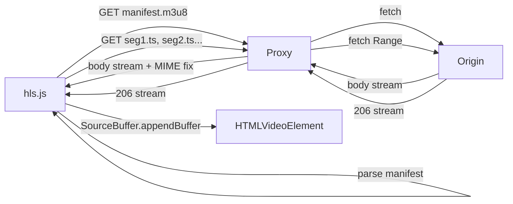
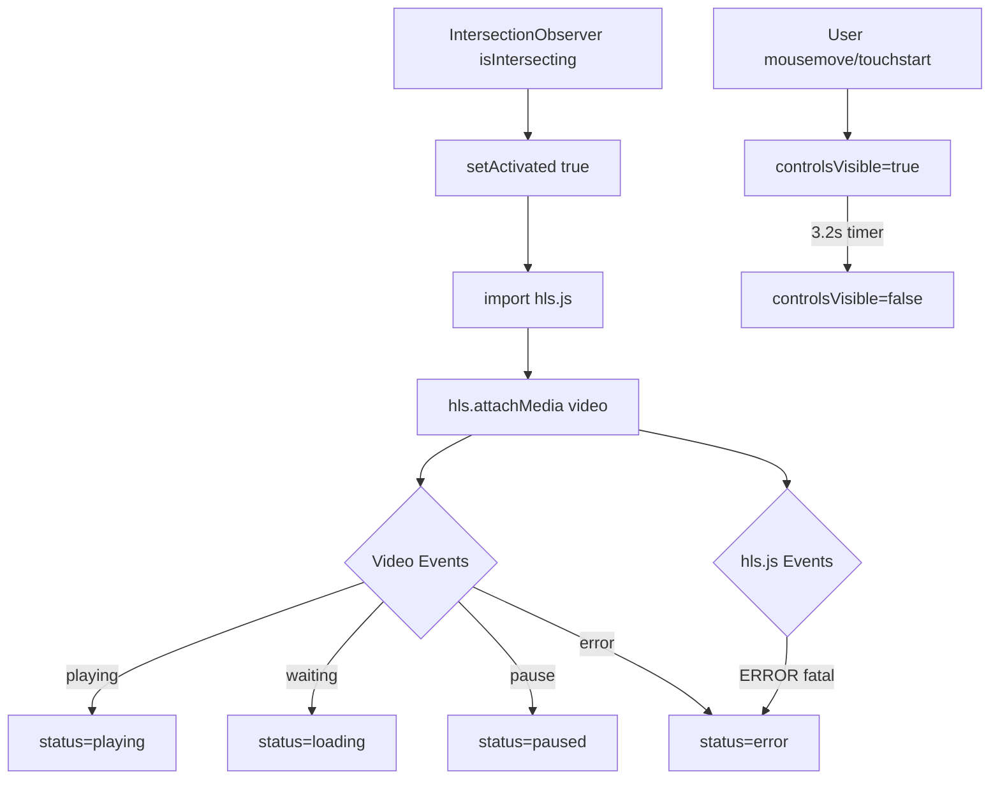
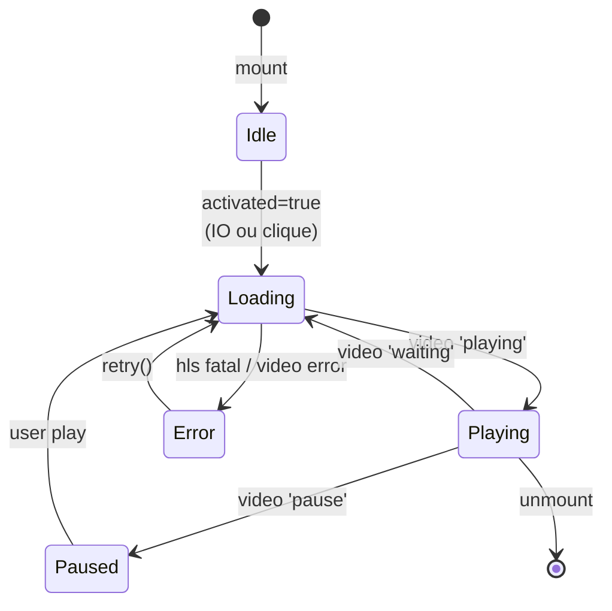

# Arquitetura dos Players

> Documento arquitetural — descreve componentes, hooks, server routes, fluxos e ciclo de vida dos players (TV e Rádio).
> Ver também: [`TV_PLAYER.md`](./TV_PLAYER.md), [`MEDIA_ENGINE.md`](./MEDIA_ENGINE.md).

---

## 1. Componentes React

### 1.1 `LivePlayer` (TV)
- Player embarcado (não flutuante), aspect-ratio 16:9.
- Video element com `playsInline autoPlay muted`.
- Máquina de estados: `idle → loading → playing | paused | error`.
- Overlays: idle (call-to-action), loading (shimmer), error (retry).
- Controles: play/pause, mute, fullscreen — sempre acessíveis via touch em mobile.

### 1.2 `RadioPlayer` (Rádio)
- Player flutuante (bottom-right, sticky).
- Estados de UI: expandido / minimizado / escondido.
- Audio element consumindo HLS de áudio via proxy `/api/public/radio/*`.
- Indicador visual de status (verde=live, âmbar=conectando, cinza=off, vermelho=erro).
- Metadata ID3 best-effort para NowPlaying.

### 1.3 Árvore de componentes atual
```text
<RootShell>
  <QueryClientProvider>
    <Outlet>
      <IndexRoute>
        <Hero />
        <LivePlayer />
        <History />
        <Ecosystem />
        <Footer />
      </IndexRoute>
    </Outlet>
    <RadioPlayer />   ← montado no layout, sticky global
  </QueryClientProvider>
</RootShell>
```

---

## 2. Hooks

### 2.1 Nativos usados hoje
- `useState` — status FSM, flags (`activated`, `inView`, `muted`, `isFullscreen`, `controlsVisible`)
- `useEffect` — attach IntersectionObserver, attach hls.js, listeners de eventos, cleanup
- `useRef` — refs para `<video>`, container, timer de esconder controles

### 2.2 Hooks customizados propostos (futuro — ver [`PLAYER_FUTURE_ARCHITECTURE.md`](./PLAYER_FUTURE_ARCHITECTURE.md))
| Hook | Responsabilidade |
|---|---|
| `useLazyActivation(ref, options)` | IntersectionObserver + auto-activate |
| `useHlsSource(video, url)` | Import dinâmico + attach + cleanup + fallback Safari |
| `useMediaStatus(video)` | Subscribe em `playing/waiting/pause/error` → FSM |
| `useMediaSession(metadata, handlers)` | Registra ações do SO/lockscreen |
| `useFullscreen(ref)` | Toggle + sync com `fullscreenchange` |
| `useAutoHideControls(delay)` | Timer para esconder overlays |

---

## 3. Server Routes

Contrato compartilhado por `hls.$.ts` e `radio.$.ts`:

```ts
type ProxyRoute = {
  OPTIONS: () => Response      // 204 + CORS + Max-Age
  GET:     (req, params) => Response  // streaming + CORS + MIME correto
  HEAD:    (req, params) => Response  // headers-only
}
```

Ambos são splat routes (`$`) sob `/api/public/`, aproveitando o bypass de auth para rotas públicas do Lovable/TanStack.

Detalhes de endpoints, códigos e headers: [`API_REFERENCE.md`](./API_REFERENCE.md).

---

## 4. Proxy HLS — Algoritmo

```text
1. Receber request (GET/HEAD/OPTIONS) em /api/public/{hls|radio}/{splat}
2. OPTIONS → responder 204 imediatamente com CORS
3. Construir URL upstream = ORIGIN + splat
4. Copiar header Range (se presente) para upstream
5. fetch(upstream, { method, headers })
6. Determinar Content-Type:
   a. Preferência: contentTypeFor(splat) (por extensão)
   b. Fallback: header do upstream
   c. Último recurso: application/octet-stream
7. Propagar headers relevantes: Content-Length, Content-Range,
   Accept-Ranges, Cache-Control, ETag, Last-Modified
8. Definir Cache-Control default:
   - .m3u8 → no-cache
   - outros → public, max-age=60
9. Anexar CORS headers
10. Retornar new Response(upstream.body, ...) → streaming
```

---

## 5. Diagramas de fluxo

### 5.1 Fluxo de dados (manifest + segmentos)


### 5.2 Fluxo de eventos


### 5.3 Fluxo de renderização (estados)


### 5.4 Fluxo de rede
```text
Browser                Proxy (Worker)             Origin
   │                        │                        │
   │──OPTIONS preflight────▶│                        │
   │◀──204 + CORS───────────│                        │
   │                        │                        │
   │──GET .m3u8────────────▶│                        │
   │                        │──GET .m3u8────────────▶│
   │                        │◀──200 (octet-stream)───│
   │◀─200 (mpegurl+CORS)────│                        │
   │                        │                        │
   │──GET seg.ts Range─────▶│                        │
   │                        │──GET seg.ts Range─────▶│
   │                        │◀──206 (stream)─────────│
   │◀─206 (mp2t+CORS)───────│  (streaming)           │
```

### 5.5 Máquina de estados canônica
| Estado | Descrição | Transições saídas |
|---|---|---|
| `idle` | Não ativado; poster visível | → `loading` (activate) |
| `loading` | Buffering / conectando | → `playing`, `error` |
| `playing` | Reproduzindo | → `paused`, `loading` (waiting), `error` |
| `paused` | Pausado pelo usuário | → `loading` (play), `error` |
| `error` | Falha fatal | → `loading` (retry) |

---

## 6. Ciclo de vida completo

```text
1. mount
   ├─ criar refs
   └─ estado inicial: status=idle, activated=false, inView=false

2. useEffect #1 (dep: activated=false)
   └─ IntersectionObserver.observe(container, rootMargin:200px)

3. IO callback: isIntersecting
   ├─ setInView(true)
   └─ io.disconnect()

4. useEffect #2 (dep: [inView, activated])
   └─ if (inView && !activated) setActivated(true)

5. useEffect #3 (dep: activated=true)
   ├─ setStatus("loading")
   ├─ addEventListener × 4 (playing, waiting, pause, error)
   ├─ (async) HlsMod = (await import("hls.js")).default
   ├─ if (cancelled) return
   ├─ if (Hls.isSupported())
   │    ├─ new Hls({ lowLatencyMode:true, backBufferLength:30 })
   │    ├─ loadSource(STREAM_URL)
   │    ├─ attachMedia(video)
   │    └─ hls.on(Events.ERROR, ...)
   ├─ else if (video.canPlayType("application/vnd.apple.mpegurl"))
   │    └─ video.src = STREAM_URL   ← Safari nativo
   ├─ else setStatus("error")
   └─ video.muted=true; video.play().catch(noop)

6. runtime (usuário)
   ├─ playing event → status=playing
   ├─ waiting event → status=loading
   ├─ pause event → status=paused
   ├─ click no vídeo → togglePlay()
   ├─ click mute → toggleMute()
   ├─ click fullscreen → requestFullscreen / exitFullscreen
   └─ mousemove/touch → mostra controles 3.2s

7. error path
   ├─ hls fatal ou video error → status=error
   └─ retry() → setActivated(false) → setTimeout(() => setActivated(true))

8. cleanup (unmount ou re-run do effect)
   ├─ cancelled = true
   ├─ hls?.destroy()
   ├─ removeEventListener × 4
   └─ removeEventListener fullscreenchange
```

---

## 7. Fronteiras e contratos

| Camada | Contrato |
|---|---|
| Route → Component | Nenhum prop; STREAM_URL constante interna |
| Component → hls.js | `new Hls(opts)`, `loadSource(url)`, `attachMedia(video)`, `on('error', cb)` |
| Component → Video Element | Events: playing/waiting/pause/error |
| Component → Proxy | HTTP GET (com Range), same-origin, sem auth |
| Proxy → Origin | HTTP GET (com Range), URL fixa em constante |
