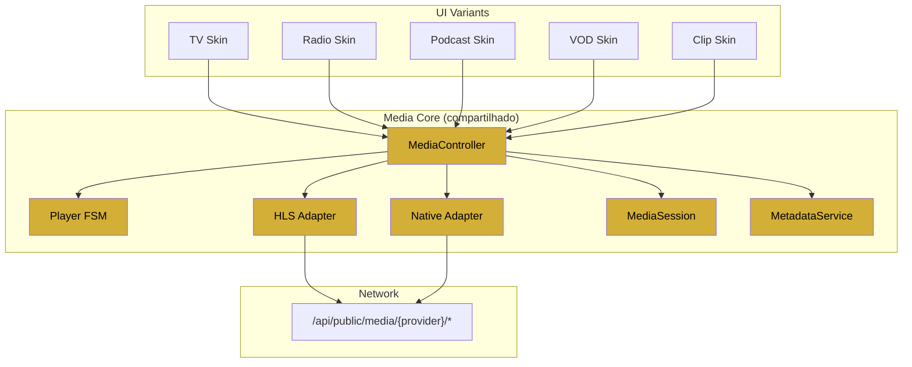

# Arquitetura Futura — Núcleo Compartilhado dos Players

> Como evoluir os players atuais (TV, Rádio) para um núcleo único que sirva também Podcasts, Clips, Shorts e VOD.
> Ver especificação detalhada em [`MEDIA_ENGINE.md`](./MEDIA_ENGINE.md).

---

## 1. Diagnóstico — o que se repete hoje

Comparando `LivePlayer.tsx` e `RadioPlayer.tsx`:

| Aspecto | TV | Rádio | Duplicado? |
|---|---|---|---|
| IntersectionObserver + lazy | ✅ | ⚠️ (sempre-on) | Parcial |
| `import("hls.js")` dinâmico | ✅ | ✅ | **Sim** |
| Fallback Safari nativo | ✅ | ✅ | **Sim** |
| FSM `idle/loading/playing/paused/error` | ✅ | ✅ (variante) | **Sim** |
| Listeners `playing/waiting/pause/error` | ✅ | ✅ | **Sim** |
| Retry (rebind) | ✅ | ✅ | **Sim** |
| Auto-hide controles | ✅ | — | Somente TV |
| Volume/mute | ✅ | ✅ | **Sim** |
| Metadata NowPlaying (ID3) | — | ✅ | Somente Rádio |
| Fullscreen | ✅ | — | Somente TV |
| Floating sticky | — | ✅ | Somente Rádio |
| Proxy same-origin + CORS | ✅ (`hls.$`) | ✅ (`radio.$`) | **Sim** — duplicado byte-a-byte |

**~70% do código é comum.** Justifica extração de núcleo compartilhado.

---

## 2. Invariantes a extrair

### 2.1 Hooks reutilizáveis
```ts
useLazyActivation(ref: RefObject<Element>, opts?: { rootMargin?: string })
  → { activated: boolean, activate: () => void }

useHlsSource(mediaEl: HTMLMediaElement, url: string, opts?: HlsOptions)
  → { status: MediaStatus, retry: () => void }

useMediaStatus(mediaEl: HTMLMediaElement)
  → MediaStatus  // 'idle' | 'loading' | 'playing' | 'paused' | 'error'

useMediaSession(metadata: MediaMetadata, actions: MediaActions)

useFullscreen(target: RefObject<Element>)
  → { isFullscreen: boolean, toggle: () => void }

useAutoHideControls(delayMs: number)
  → { visible: boolean, show: () => void }

useVolume(mediaEl: HTMLMediaElement)
  → { volume: number, muted: boolean, setVolume, toggleMute }
```

### 2.2 Componentes headless
```ts
<MediaProvider url source={video|audio}>
  <MediaControls />
  <StatusIndicator />
  <VolumeSlider />
  <FullscreenToggle />
  <FloatingShell dockable draggable />
</MediaProvider>
```

### 2.3 Serviços
- **ProxyClient** — abstração sobre `/api/public/{provider}/*` com cache-busting opcional.
- **MetadataService** — extrai ID3 (áudio) / cues 608/708 (vídeo) / manifest tags.
- **MediaSessionService** — bridge para Media Session API.

---

## 3. Superfícies-alvo

| Superfície | Fonte | Auto-play | Metadata | Controles | Floating | PiP |
|---|---|---|---|---|---|---|
| **TV Live** | HLS (m3u8) | muted | — | full | opcional | vídeo PiP |
| **Rádio Live** | HLS áudio | muted | ID3 | mínimo | ✅ sticky | Doc PiP |
| **Podcast** | MP3/HLS VOD | não | RSS | full + seek | ✅ sticky | Doc PiP |
| **VOD** | HLS VOD | não | manifest | full + DVR | opcional | vídeo PiP |
| **Clips/Shorts** | MP4 curto | muted | mínima | mínimo | — | — |

Todas convergem no mesmo núcleo com **variantes de UI**.

---

## 4. Diagrama do núcleo compartilhado



---

## 5. Estratégia de migração incremental

**Não fazer big-bang.** Sequência sugerida:

1. **Fase A** — Extrair `useHlsSource` e `useMediaStatus`; refatorar `LivePlayer` e `RadioPlayer` para consumi-los. Sem mudança de comportamento.
2. **Fase B** — Unificar proxies em `/api/public/media/[provider]/*` com allow-list de providers.
3. **Fase C** — Extrair `<MediaControls>` headless; skins específicas por superfície.
4. **Fase D** — Adicionar `useMediaSession` (novo comportamento; ver [ADR-0008](./adr/0008-media-session-api.md)).
5. **Fase E** — `<FloatingShell>` reutilizável; migrar Radio Player.
6. **Fase F** — Suporte a Podcasts (VOD de áudio) e VOD (seek + DVR).
7. **Fase G** — Clips/Shorts.

Cada fase é isolada, testável, e reversível.

---

## 6. Anti-metas

Evitar:
- ❌ Framework de player genérico com 100 opções (video.js, JW Player) — perde-se o controle fino.
- ❌ Reescrita completa em um único PR.
- ❌ Abstração prematura antes de ter 3+ casos de uso.
- ❌ Estado global compartilhado (Redux/Zustand) para instância única de player.
