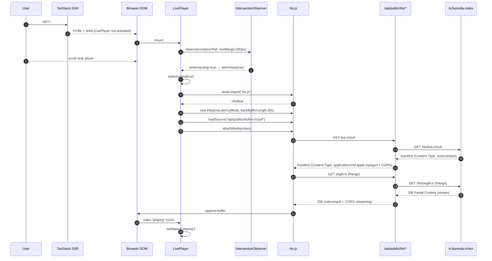
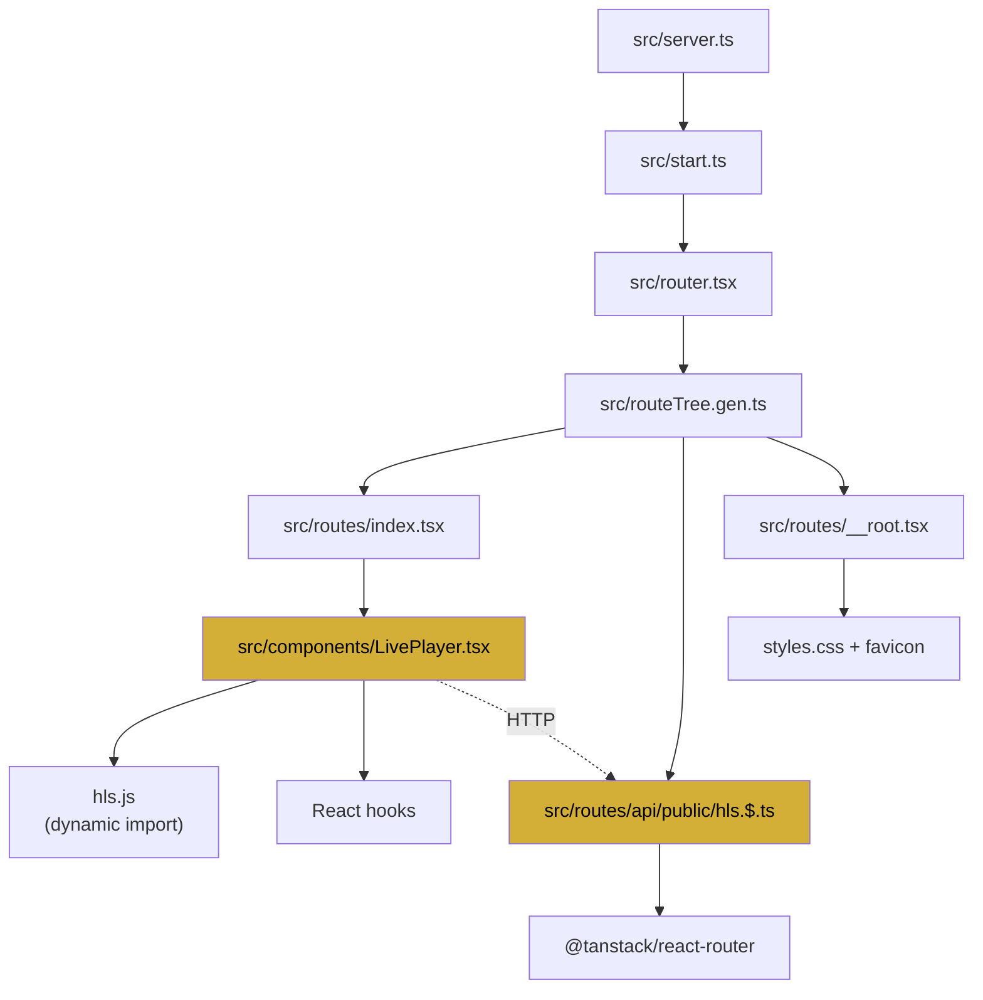

# TV Player — Documentação Técnica & Engenharia Reversa

> Documento canônico da implementação atual do **TV Player** da Fazenda Rodeo.
> Complementa: [`PLAYER_ARCHITECTURE.md`](./PLAYER_ARCHITECTURE.md), [`API_REFERENCE.md`](./API_REFERENCE.md), [`REFERENCE_ARCHITECTURE.md`](./REFERENCE_ARCHITECTURE.md).

---

## 1. Escopo e objetivos

O TV Player entrega uma transmissão HLS ao vivo (`live.m3u8`) com experiência cinematográfica premium, sem exigir instalação de plugin, funcionando em desktop e mobile (incluindo iOS Safari), com **autoplay muted** e **ativação preguiçosa** (lazy) para preservar performance.

**Requisitos atendidos:**
- HLS via `hls.js` em browsers com MSE; HLS nativo em Safari.
- Sem CORS de terceiros: proxy same-origin corrige headers e MIME.
- Autoplay `muted` + `playsInline` para funcionar em mobile.
- Controles sempre acessíveis (mobile) — mute/play/fullscreen.
- Estados visuais claros: idle → loading → playing → paused → error.
- Retry manual em caso de erro fatal.
- Lazy load: HLS só carrega quando o player entra na viewport (`rootMargin: 200px`).

---

## 2. Arquitetura — Diagrama Mermaid

```mermaid
flowchart LR
    subgraph Browser["🌐 Browser"]
        Route["/ (index.tsx)"]
        LP[LivePlayer.tsx]
        IO[IntersectionObserver]
        Video[HTMLVideoElement]
        Hls[hls.js<br/>dynamic import]
    end

    subgraph Edge["⚡ TanStack Start Worker"]
        Proxy["hls.$.ts<br/>/api/public/hls/*"]
    end

    subgraph Origin["🎬 Origin"]
        Src["tv.fazenda.rodeo<br/>/hls/*"]
    end

    Route --> LP
    LP -->|observe| IO
    IO -->|inView| LP
    LP -->|import()| Hls
    Hls -->|attachMedia| Video
    Hls -->|GET manifest/segments| Proxy
    Video -->|Safari nativo| Proxy
    Proxy -->|fetch| Src

    classDef c fill:#1a1a2e,stroke:#d4af37,color:#fff
    class Route,LP,IO,Video,Hls,Proxy,Src c
```

## 3. Arquitetura — ASCII

```text
┌──────────────────────────── Browser ─────────────────────────────┐
│                                                                  │
│   / (index.tsx)                                                  │
│        │                                                         │
│        ▼                                                         │
│   ┌─────────────────────┐        ┌──────────────────────┐        │
│   │  LivePlayer.tsx     │◀──────▶│ IntersectionObserver │        │
│   │  ─────────────────  │        └──────────────────────┘        │
│   │  status FSM         │                                        │
│   │  activated flag     │        ┌──────────────────────┐        │
│   │  controls timer     │───────▶│ hls.js (dyn import)  │        │
│   └────────┬────────────┘        └──────────┬───────────┘        │
│            │ attach                          │                   │
│            ▼                                 │                   │
│   ┌─────────────────────┐                    │                   │
│   │ HTMLVideoElement    │◀───────────────────┘ attachMedia       │
│   │  (playsInline,      │                                        │
│   │   autoPlay, muted)  │                                        │
│   └─────────────────────┘                                        │
└──────────────────────┬───────────────────────────────────────────┘
                       │ GET /api/public/hls/live.m3u8
                       │ GET /api/public/hls/segNNN.ts (Range: ...)
                       ▼
┌───────────────── TanStack Start Worker ──────────────────────────┐
│  hls.$.ts (splat route)                                          │
│   • fixes Content-Type (m3u8, ts, mp4)                           │
│   • adds CORS headers                                            │
│   • forwards Range header                                        │
│   • streams response.body (no buffering)                         │
└──────────────────────┬───────────────────────────────────────────┘
                       │ fetch upstream (streaming)
                       ▼
┌───────────────────── Origin ─────────────────────────────────────┐
│  https://tv.fazenda.rodeo/hls/*                                  │
└──────────────────────────────────────────────────────────────────┘
```

---

## 4. Fluxograma end-to-end



### ASCII do fluxo
```text
mount → observe → inView → activated → import(hls.js) → new Hls → loadSource
   → attachMedia → GET manifest (proxy) → GET segments (proxy, Range)
   → append buffer → 'playing' event → status=playing
```

---

## 5. Mapa de dependências entre arquivos



### Tabela quem-importa-quem

| Arquivo | Importa | Tipo |
|---|---|---|
| `src/routes/index.tsx` | `LivePlayer` (relativo) | Estático |
| `src/components/LivePlayer.tsx` | `react` | Estático |
| `src/components/LivePlayer.tsx` | `hls.js` | **Dinâmico** (`await import`) |
| `src/routes/api/public/hls.$.ts` | `@tanstack/react-router` | Estático |
| `src/routeTree.gen.ts` | `index`, `hls.$`, `__root` | Estático (gerado) |
| `src/router.tsx` | `routeTree.gen.ts` | Estático |
| Runtime (browser) | `/api/public/hls/*` | HTTP (mesma origem) |

---

## 6. Árvore de arquivos exclusivos do TV Player

```text
project/
├── src/
│   ├── components/
│   │   └── LivePlayer.tsx              ◀── COMPONENTE PRINCIPAL
│   ├── routes/
│   │   ├── api/public/
│   │   │   └── hls.$.ts                ◀── PROXY (splat route)
│   │   └── index.tsx                   ◀── ponto de integração
│   └── routeTree.gen.ts                (gerado — não editar)
├── package.json                        (dependência: hls.js@^1.6.16)
└── docs/
    ├── TV_PLAYER.md                    (este arquivo)
    ├── PLAYER_ARCHITECTURE.md
    └── API_REFERENCE.md
```

Arquivos indiretamente envolvidos (não editar por causa do player):
- `src/routes/__root.tsx` — shell HTML, fontes, favicon
- `src/router.tsx`, `src/start.ts`, `src/server.ts` — bootstrap TanStack Start
- `src/styles.css` — classes visuais (`eyebrow`, `shimmer`, `animate-live`, `bg-gold`)

---

## 7. Engenharia Reversa — Arquivo por Arquivo

### 7.1 `src/components/LivePlayer.tsx`

**Responsabilidade:** Componente React que orquestra ciclo de vida do vídeo, lazy loading, integração com `hls.js`, controles UI e máquina de estados de reprodução.

**Entradas:** Nenhuma (constante `STREAM_URL = "/api/public/hls/live.m3u8"` fixa).

**Saídas:** JSX com `<video>` + overlays (idle, loading, error, controles).

**Dependências:**
- React (`useEffect`, `useRef`, `useState`)
- `hls.js` (dinâmico)
- APIs DOM: `IntersectionObserver`, `HTMLVideoElement`, `document.fullscreenElement`

**APIs utilizadas:**
| API | Uso |
|---|---|
| `IntersectionObserver` | Detectar quando o player entra na viewport (`rootMargin: 200px`) |
| `HTMLVideoElement` | `play()`, `pause()`, `muted`, `playing`/`waiting`/`pause`/`error` events |
| `hls.js` | `isSupported()`, `new Hls()`, `loadSource()`, `attachMedia()`, `Events.ERROR` |
| `Element.requestFullscreen()` / `document.exitFullscreen()` | Tela cheia |
| `document.fullscreenchange` | Sync estado UI |
| `HTMLMediaElement.canPlayType("application/vnd.apple.mpegurl")` | Fallback Safari |

**Eventos disparados/escutados:**
- `video: playing` → `status = "playing"`
- `video: waiting` → `status = "loading"`
- `video: pause` → `status = "paused"`
- `video: error` → `status = "error"`
- `hls: Events.ERROR (fatal)` → `status = "error"`
- `document: fullscreenchange` → toggle UI icon
- `mouse/touch: mousemove, touchstart` → mostra controles + timer 3.2s

**Pontos de falha:**
| Falha | Sintoma | Mitigação atual |
|---|---|---|
| HLS não suportado + Safari indisponível | `status = "error"` | Botão retry |
| `hls.js` fatal error | UI de erro | `hls.destroy()` no cleanup + retry manual |
| Autoplay bloqueado | Vídeo pausado apesar de `muted` | `playsInline` + `muted` + `catch(() => {})` |
| Origin fora do ar (5xx no proxy) | Waiting infinito, depois error | Botão retry re-monta HLS |
| Componente desmontado durante import assíncrono | Race condition | Flag `cancelled` + cleanup |

**Como reutilizar em outro projeto:**
1. Copiar o arquivo mantendo os hooks nativos.
2. Trocar `STREAM_URL` pela sua rota de proxy.
3. Garantir que o proxy siga o contrato de `hls.$.ts` (CORS, MIME correto).
4. Adaptar classes Tailwind ao design system do projeto-alvo.

---

### 7.2 `src/routes/api/public/hls.$.ts`

**Responsabilidade:** Proxy same-origin que resolve dois problemas do origin real:
1. **CORS ausente** — o browser bloqueia `fetch` cross-origin sem `Access-Control-Allow-Origin`.
2. **Content-Type incorreto** — origin retorna `application/octet-stream` para `.m3u8`, o que impede `hls.js` de detectar o formato.

Adicionalmente propaga **Range requests** para permitir seeking/partial content.

**Entradas:** Path splat (`_splat`) — o restante do caminho após `/api/public/hls/`. Headers opcionais: `Range`.

**Saídas:** `Response` com body em streaming, headers CORS + Content-Type correto.

**Dependências:** `@tanstack/react-router` (`createFileRoute`), Fetch API nativa (Web Standard).

**APIs utilizadas:**
- `fetch()` — Web Standard
- `Response` streaming via `response.body`
- Headers: `Range`, `Content-Type`, `Content-Length`, `Content-Range`, `Accept-Ranges`, `Cache-Control`, `ETag`, `Last-Modified`
- CORS: `Access-Control-Allow-Origin`, `Allow-Methods`, `Allow-Headers`, `Expose-Headers`, `Max-Age`

**Handlers:**
- `OPTIONS` → 204 + CORS + `Max-Age: 86400`
- `GET` → proxy com streaming
- `HEAD` → proxy sem body

**Content-Type por extensão:**
| Ext | MIME |
|---|---|
| `.m3u8` | `application/vnd.apple.mpegurl` |
| `.ts` | `video/mp2t` |
| `.m4s` / `.mp4` | `video/mp4` |
| `.key` | `application/octet-stream` |

**Cache:**
- Manifesto (`.m3u8`): `no-cache` (conteúdo muda a cada janela)
- Segmentos: `public, max-age=60`
- Sempre respeita `ETag` / `Last-Modified` do upstream se presentes

**Pontos de falha:**
| Falha | Sintoma | Mitigação |
|---|---|---|
| Upstream 5xx | Response propagada com mesmo status | Client faz retry |
| Timeout do worker | Response nunca chega | Cloudflare aplica limite; sem retry automático |
| Origin muda para HTTPS quebrado | Fetch falha | Alerta operacional (fora do escopo do código) |
| Ataque SSRF | ⚠️ **Não aplica** — `ORIGIN` é constante fixa | Ver `SECURITY.md` |

**Como reutilizar em outro projeto:**
1. Adaptar assinatura ao framework (Next.js `route.ts`, Remix `loader`, Hono handler).
2. Trocar `ORIGIN` pela URL upstream real.
3. Estender `contentTypeFor()` se usar formatos adicionais (LL-HLS, CMAF).
4. Adicionar allow-list se o proxy passar a receber múltiplas origens.

---

### 7.3 `src/routes/index.tsx`

**Responsabilidade:** Página principal — importa e renderiza `<LivePlayer />` numa seção dedicada.

**Papel no player:** Apenas o **ponto de integração**. Nenhuma lógica de player vive aqui.

**Reuso:** Trivial — `<LivePlayer />` é auto-contido.

---

### 7.4 `src/routes/__root.tsx`

**Responsabilidade:** Shell HTML global, metadados SEO (Open Graph, Twitter Card), fontes (Playfair Display, Cormorant, Inter), favicon, error/notFound boundaries.

**Papel no player:** Fornece o contexto (fontes, tokens) mas **não** contém lógica do player.

**Ponto de atenção:** o `<video>` do player herda estilos globais definidos em `styles.css` importado aqui.

---

### 7.5 `src/routeTree.gen.ts`

**Gerado automaticamente** pelo Vite plugin do TanStack Router. Nunca editar. Registra o splat route `/api/public/hls/$` como handler.

---

### 7.6 `src/router.tsx`, `src/start.ts`, `src/server.ts`

Bootstrap padrão TanStack Start. Não contêm lógica específica do player.

---

### 7.7 `src/styles.css`

Define classes utilizadas pelo player:
- `eyebrow` — texto tracking wide uppercase
- `shimmer` — linha animada durante loading
- `animate-live` — pulsação do dot vermelho quando `status="playing"`
- `bg-gold` — botão de ação

---

### 7.8 `package.json`

Dependência crítica: **`hls.js@^1.6.16`**. Nenhuma outra dependência é exclusiva do player.

---

## 8. Decisões-chave

Cada decisão tem um ADR dedicado em [`docs/adr/`](./adr/):

| Decisão | ADR |
|---|---|
| Usar `hls.js` em vez de player pronto (video.js/Shaka) | [ADR-0001](./adr/0001-usar-hls-js.md) |
| Proxy same-origin em vez de habilitar CORS no origin | [ADR-0002](./adr/0002-proxy-same-origin.md) |
| `import("hls.js")` dinâmico | [ADR-0003](./adr/0003-import-dinamico-hls.md) |
| `IntersectionObserver` para lazy activation | [ADR-0004](./adr/0004-intersection-observer-lazy.md) |
| TanStack Start como runtime | [ADR-0005](./adr/0005-tanstack-start.md) |
| Streaming em vez de buffer no proxy | [ADR-0006](./adr/0006-streaming-vs-buffer.md) |
| Encaminhar Range requests | [ADR-0007](./adr/0007-range-requests.md) |
| Adotar Media Session (futuro) | [ADR-0008](./adr/0008-media-session-api.md) |
| Document PiP como enhancement progressivo | [ADR-0009](./adr/0009-document-picture-in-picture.md) |
