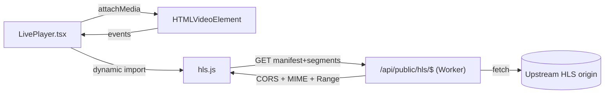
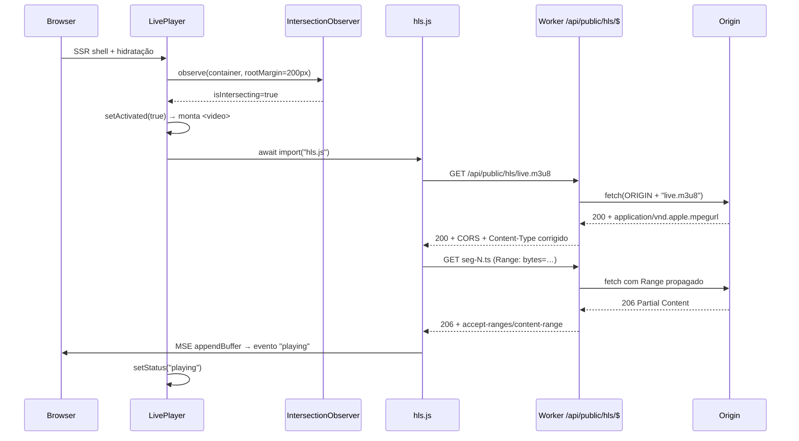

# TV Player — Engenharia Reversa (Documentação Definitiva)

> Fonte de verdade técnica para reproduzir o TV Player da Fazenda Rodeo em outros projetos ou por outras IAs, sem acesso ao código-fonte original.
> Toda afirmação foi validada contra a implementação real. Convenção de status: ✅ implementado · ⚠️ parcial · 🔮 evolução futura · ❌ não existe.

Documentos relacionados: [`./TV_PLAYER.md`](./TV_PLAYER.md), [`./PLAYER_ARCHITECTURE.md`](./PLAYER_ARCHITECTURE.md), [`./API_REFERENCE.md`](./API_REFERENCE.md), [`./adr/`](./adr/).

---

## 1. Visão geral da arquitetura

Stack real observado no projeto:

- TanStack Start v1 (file-based routes) + React 19 + Vite 8 + Tailwind v4
- `hls.js@^1.6.16` (carregado por import dinâmico)
- Runtime servidor: Cloudflare Workers (workerd) via Nitro — configurado por `@lovable.dev/vite-tanstack-config`

O player é um componente React que consome um stream HLS através de um **proxy same-origin** hospedado como rota TanStack sob `/api/public/*`. O proxy adiciona CORS, corrige MIME types e faz streaming direto do upstream sem buffering intermediário.

### Diagrama ASCII

```text
┌───────────────────────┐   HLS.js / HLS nativo    ┌────────────────────────┐
│  Browser (React 19)   │ ───────────────────────► │  <video> element       │
│  <LivePlayer>         │                          └────────────┬───────────┘
│  IntersectionObserver │                                       │ requests
│  dynamic import()     │                                       ▼
└──────────┬────────────┘                          ┌────────────────────────┐
           │  GET /api/public/hls/live.m3u8        │  TanStack Server Route │
           │  GET /api/public/hls/seg-N.ts (Range) │  /api/public/hls/$     │
           └──────────────────────────────────────►│  (Cloudflare Worker)   │
                                                   └────────────┬───────────┘
                                                                │ fetch()
                                                                ▼
                                                   ┌────────────────────────┐
                                                   │ tv.fazenda.rodeo/hls/  │
                                                   │ Upstream HLS origin    │
                                                   └────────────────────────┘
```

### Diagrama Mermaid



Fronteiras:
- **Cliente** decide *quando* carregar (lazy) e *como* reproduzir (HLS.js vs nativo).
- **Worker** é um proxy fino: sem lógica de negócio, sem estado, sem transformações no corpo.
- **Origin** é opaco para o cliente: nenhum request cruza cross-origin.

---

## 2. Fluxo completo — mount até o primeiro frame



---

## 3. Compatibilidade entre navegadores

| Navegador           | Engine    | Método                | Observações                                                  |
| ------------------- | --------- | --------------------- | ------------------------------------------------------------ |
| Chrome Desktop      | Chromium  | HLS.js + MSE          | `Hls.isSupported()` = true; caminho preferido                |
| Edge Desktop        | Chromium  | HLS.js + MSE          | Idêntico ao Chrome                                           |
| Firefox Desktop     | Gecko     | HLS.js + MSE          | Sem HLS nativo; depende de MSE                               |
| Safari macOS        | WebKit    | HLS nativo            | `canPlayType("application/vnd.apple.mpegurl") === "maybe"`   |
| Safari iOS          | WebKit    | HLS nativo            | Requer `playsInline`; fullscreen só via elemento `<video>`   |
| Chrome Android      | Chromium  | HLS.js + MSE          | MSE disponível; nativo é fallback                            |
| WebViews (WKWebKit) | WebKit    | HLS nativo            | Segue Safari                                                 |

**Por que Safari não usa HLS.js:** WebKit em iOS restringe `MediaSource` (Managed MSE só em versões recentes) e oferece HLS nativo de alta qualidade — usar HLS.js aumentaria bundle sem benefício. O código faz `Hls.isSupported()` → se falso, tenta `video.canPlayType("application/vnd.apple.mpegurl")` → se falso, marca erro.

**Autoplay / mobile:** o `<video>` é montado com `autoPlay muted playsInline` — mute é obrigatório para autoplay em todos os browsers móveis. `playsInline` impede fullscreen forçado no iOS. Fullscreen do container `<div>` funciona em desktop; no iOS a Fullscreen API padrão só aceita o próprio elemento `<video>` (limitação conhecida).

---

## 4. Arquivos responsáveis pela reprodução

| Arquivo                             | Responsabilidade                                                                       | Entradas                        | Saídas                                    |
| ----------------------------------- | -------------------------------------------------------------------------------------- | ------------------------------- | ----------------------------------------- |
| `src/components/LivePlayer.tsx`     | Componente React: FSM, lazy activation, controles, HLS.js dinâmico, fallback nativo    | Nenhuma prop                    | JSX + eventos de vídeo                    |
| `src/routes/api/public/hls.$.ts`    | Rota Worker splat: proxy same-origin, CORS, MIME, Range                                | `Request` HTTP                  | `Response` streaming                      |
| `src/routes/index.tsx`              | Montagem do `<LivePlayer />` na home                                                   | —                               | Árvore de UI                              |
| `src/routes/__root.tsx`             | Shell HTML, `<head>` (título, meta, favicon), fontes                                   | —                               | Documento SSR                             |
| `src/styles.css`                    | Tokens de design + animação `animate-live` usada no indicador de status                | —                               | CSS global                                |
| `package.json`                      | Declara `hls.js@^1.6.16`                                                               | —                               | Dependência                               |
| `vite.config.ts`                    | TanStack Start + Nitro Cloudflare (via `@lovable.dev/vite-tanstack-config`)            | —                               | Build/runtime do Worker                   |

Comunicação: `index.tsx` importa `LivePlayer`, que faz `fetch` para o path relativo `/api/public/hls/live.m3u8` — mesma origem do documento. O restante é opaco.

---

## 5. HLS e streaming

- Biblioteca: `hls.js@^1.6.16`, importada com `await import("hls.js")` **somente após activation** — sai do bundle inicial.
- Config real usada: `{ lowLatencyMode: true, backBufferLength: 30 }`.
- Extensões manipuladas pelo proxy:

  | Extensão | Content-Type retornado             |
  | -------- | ---------------------------------- |
  | `.m3u8`  | `application/vnd.apple.mpegurl`    |
  | `.ts`    | `video/mp2t`                       |
  | `.m4s`   | `video/mp4`                        |
  | `.mp4`   | `video/mp4`                        |
  | `.key`   | `application/octet-stream`         |

- Range requests: o cliente HLS.js envia `Range: bytes=…` para segmentos; o proxy propaga e devolve `Content-Length`, `Content-Range`, `Accept-Ranges` (necessário para seek e ABR).
- Erros: `Hls.Events.ERROR` com `data.fatal === true` transiciona para `error`; retry manual remonta o pipeline (desativa e reativa `activated`).
- 🔮 Evoluções: ABR customizado, DVR/timeshift, múltiplas fontes, low-latency LL-HLS full.

Snippet ilustrativo (referência, não é cópia literal):

```ts
const Hls = (await import("hls.js")).default;
if (Hls.isSupported()) {
  const hls = new Hls({ lowLatencyMode: true, backBufferLength: 30 });
  hls.loadSource("/api/public/hls/live.m3u8");
  hls.attachMedia(videoEl);
} else if (videoEl.canPlayType("application/vnd.apple.mpegurl")) {
  videoEl.src = "/api/public/hls/live.m3u8";
}
```

---

## 6. Proxy, CORS e servidor

Rota TanStack em `src/routes/api/public/hls.$.ts` — splat que casa qualquer caminho abaixo de `/api/public/hls/`.

- Handlers: `OPTIONS` (204 + preflight), `GET`, `HEAD`.
- Origem fixa em constante `ORIGIN = "https://tv.fazenda.rodeo/hls/"` — **não** aceita URL vinda do cliente (mitigação anti-SSRF / anti open-proxy).
- Cabeçalhos CORS:
  ```
  Access-Control-Allow-Origin: *
  Access-Control-Allow-Methods: GET, HEAD, OPTIONS
  Access-Control-Allow-Headers: Range, Content-Type
  Access-Control-Expose-Headers: Content-Length, Content-Range, Accept-Ranges
  ```
- Propaga do upstream: `content-length`, `content-range`, `accept-ranges`, `cache-control`, `etag`, `last-modified`.
- Default `Cache-Control` quando ausente: `no-cache` para `.m3u8`, `public, max-age=60` para segmentos.
- Streaming: repassa `upstream.body` diretamente no `new Response(...)` — o Worker **não** bufferiza.

Exemplo de request/response reais:

```
GET /api/public/hls/live.m3u8 HTTP/1.1
→ 200 OK
  Content-Type: application/vnd.apple.mpegurl
  Cache-Control: no-cache
  Access-Control-Allow-Origin: *
```

```
GET /api/public/hls/segment-42.ts HTTP/1.1
Range: bytes=0-
→ 206 Partial Content
  Content-Type: video/mp2t
  Accept-Ranges: bytes
  Content-Range: bytes 0-524287/1048576
  Access-Control-Allow-Origin: *
```

---

## 7. Performance

- **Lazy activation** via `IntersectionObserver({ rootMargin: "200px" })` → não faz rede antes do usuário se aproximar.
- **`hls.js` fora do bundle inicial** — import dinâmico atrás da activation.
- **Streaming no Worker** sem cópia intermediária (`Response(upstream.body)`).
- **CLS zero**: container `aspect-video` reserva espaço.
- **LCP intacto**: overlay/poster CSS em vez de imagem pesada; primeiro frame carrega sob interação/scroll.
- **Autoplay muted + playsInline**: primeiro frame chega sem exigir clique em desktop e mobile.
- **Cache de segmentos** curto no proxy (`max-age=60`) — seguro pois manifesto é `no-cache`.
- 🔮 Evoluções: preload/prefetch do manifest, service worker de segmentos, poster estático otimizado, upgrade a Managed MSE em Safari.

---

## 8. Estados e tratamento de erros

FSM implementada (tipo union real):

```
"idle" → "loading" → "playing"
                 ↘ "paused"
                 ↘ "error"
```

- Eventos observados: `playing`, `waiting`, `pause`, `error` no `<video>`; `Hls.Events.ERROR` (`data.fatal`).
- Overlays por estado: idle (CTA "Toque para assistir"), loading (shimmer + "Ajuste sua antena…"), error ("Sinal indisponível" + botão "Tentar novamente").
- Retry: reset de `activated` (false → true) remonta a pipeline HLS.
- 🔮 Evoluções: reconexão automática com backoff, telemetria de erros, distinção network/media/mux errors.

---

## 9. Segurança

Verificado no código:
- `/api/public/*` é público por design (bypassa autenticação da plataforma) — apropriado para stream público.
- `Access-Control-Allow-Origin: *` — recurso público, sem cookies/credenciais.
- Origem hard-coded no servidor — usuário não controla o alvo do `fetch`; sem SSRF/open-proxy.
- Sem tokens, sem sessão, sem PII no fluxo.

🔮 Evoluções (não implementadas):
- Autenticação do stream (token assinado HMAC/JWT com expiração)
- Allow-list de `Origin`/`Referer`
- Rate-limit por IP no Worker
- DRM: Widevine, FairPlay, PlayReady
- Controle de acesso por usuário/entitlement

---

## 10. Como portar para outro projeto

Checklist mínimo:

1. Instalar `hls.js@^1.6`.
2. Criar componente React equivalente a `LivePlayer` com FSM `idle/loading/playing/paused/error`, `<video autoPlay muted playsInline>`, controles próprios.
3. Criar rota-proxy no servidor da sua stack (Cloudflare Worker, Next route handler, Fastify, Express) com **origem fixa em constante**, splat de caminho, handlers OPTIONS/GET/HEAD.
4. Aplicar CORS, MIME por extensão, propagar `Range`/`Content-Range`/`Accept-Ranges`, streamar corpo do upstream sem buffering.
5. Fazer o cliente apontar para o path **same-origin** do proxy.
6. Import dinâmico do `hls.js`; fallback nativo via `video.canPlayType("application/vnd.apple.mpegurl")`.
7. Ativar o player só após IntersectionObserver disparar.
8. Testar em Chrome, Firefox, Edge (HLS.js) e Safari macOS/iOS (nativo) e Android Chrome.
9. Validar autoplay muted + `playsInline` em mobile.
10. Medir LCP e CLS — reservar aspect ratio no container.

Adaptações típicas: trocar `ORIGIN` e `STREAM_URL`. Nenhuma outra parte é acoplada ao domínio.

---

## 11. Guia para outra IA reconstruir (10 etapas com critério de aceite)

| # | Etapa                     | Critério de aceite                                                          |
| - | ------------------------- | --------------------------------------------------------------------------- |
| 1 | Componente visual         | Container com `aspect-video`, overlays idle/loading/error                   |
| 2 | Elemento `<video>`        | Renderizado apenas após activation; `autoPlay muted playsInline`            |
| 3 | HLS.js                    | Import dinâmico; usado apenas se `Hls.isSupported()`                        |
| 4 | Proxy same-origin         | Rota splat servindo qualquer arquivo sob um prefixo público                 |
| 5 | CORS                      | Preflight OPTIONS 204; headers em toda resposta, inclusive erros            |
| 6 | MIME types                | `.m3u8`→mpegurl, `.ts`→mp2t, `.m4s/.mp4`→mp4, `.key`→octet-stream           |
| 7 | Lazy loading              | Nenhum `fetch` HLS até IntersectionObserver disparar                        |
| 8 | Estados                   | FSM `idle/loading/playing/paused/error` refletida em UI                     |
| 9 | Testes de browsers        | Reproduz em Chrome/Firefox/Edge/Android; fallback ok em Safari macOS/iOS    |
| 10| Validação de performance  | Sem CLS, `hls.js` fora do bundle inicial, primeiro frame < 3s em 4G         |

---

## 12. Decisões arquiteturais e justificativas

Cada decisão em quatro campos. Referências cruzadas a ADRs em `docs/adr/` quando existentes.

### 12.1 HLS.js com fallback HLS nativo
- **Decisão:** usar HLS.js em navegadores com MSE; cair para HLS nativo do WebKit em Safari/iOS.
- **Motivo:** HLS.js oferece controle, LL-HLS e ABR onde o navegador não tem HLS nativo; Safari já tem HLS nativo maduro, dispensando MSE.
- **Alternativas:** dash.js/DASH puro, WebRTC/WHEP, Video.js, Shaka Player, iframe externo.
- **Consequência:** cobertura universal com bundle pequeno; comportamento levemente diferente entre engines (aceito).

### 12.2 Proxy same-origin em `/api/public/hls/$`
- **Decisão:** todo tráfego HLS passa por rota do próprio app.
- **Motivo:** origem não emite CORS nem MIME corretos; same-origin elimina preflight e simplifica cache/CDN.
- **Alternativas:** ajustar servidor de origem, CDN intermediária (Cloudflare Stream), CORS proxy público.
- **Consequência:** custo de banda passa pelo Worker; ganho de portabilidade e segurança (origem escondida).

### 12.3 Streaming direto (sem buffer no Worker)
- **Decisão:** `new Response(upstream.body, …)` — repassa o `ReadableStream`.
- **Motivo:** latência mínima, uso de memória constante, compatível com Workers (limite de CPU/memória).
- **Alternativas:** ler `arrayBuffer()` e reenviar, transformar via `TransformStream`.
- **Consequência:** não é possível inspecionar/reescrever o corpo — aceito.

### 12.4 Import dinâmico de `hls.js`
- **Decisão:** `await import("hls.js")` só após activation.
- **Motivo:** ~100KB gzip fora do bundle inicial; usuário que não vê o player não paga o custo.
- **Alternativas:** import estático, preload via `<link rel="modulepreload">`.
- **Consequência:** pequeno atraso ao primeiro play; aceitável para conteúdo lazy.

### 12.5 IntersectionObserver para activation
- **Decisão:** `rootMargin: "200px"`, dispara `activated=true`.
- **Motivo:** economiza rede/CPU até o usuário se aproximar da tela; reduz custo do Worker.
- **Alternativas:** carregar imediatamente, exigir clique manual, timeout.
- **Consequência:** primeiro play acontece um pouco depois do scroll; melhor LCP.

### 12.6 Execução em Cloudflare Worker
- **Decisão:** proxy hospedado no runtime edge do próprio app (Nitro/Cloudflare).
- **Motivo:** proximidade geográfica, escalabilidade, mesmo deploy do frontend.
- **Alternativas:** Node server dedicado, edge function em outra plataforma.
- **Consequência:** restrições do runtime (sem `child_process`, sem FS real) — irrelevantes aqui.

### 12.7 SSR seguro
- **Decisão:** nenhum acesso a `window`/`document`/`hls.js` fora de `useEffect`.
- **Motivo:** o componente é renderizado no servidor; toques globais quebram SSR.
- **Alternativas:** `<ClientOnly>` wrapper, `typeof window` guards no render.
- **Consequência:** hidratação limpa; requer disciplina para manter side-effects em effects.

---

## 13. Limitações conhecidas (confirmadas no código)

- ❌ Sem DRM (Widevine/FairPlay/PlayReady).
- ❌ Sem autenticação do stream (nenhum token, nenhum header de auth).
- ❌ Sem controle de acesso por usuário/entitlement.
- ❌ Sem DVR / timeshift / gravação.
- ❌ Fonte única hard-coded (`ORIGIN` constante).
- ❌ Sem ABR customizado (usa comportamento default de HLS.js).
- ❌ Sem legendas / trilhas alternativas / múltiplos áudios.
- ❌ Sem analytics/telemetria de playback.
- ❌ Sem Media Session API (metadata em lockscreen/notification).
- ❌ Sem Picture-in-Picture nem Document Picture-in-Picture.
- ❌ Sem Chromecast / AirPlay (botão dedicado).
- ⚠️ Reconexão apenas manual (botão "Tentar novamente") — sem backoff automático.
- ⚠️ Fullscreen aplicado ao container `<div>`: em iOS o Safari só aceita fullscreen no `<video>` (comportamento degradado).
- ❌ Sem rate-limit no proxy.

---

## 14. Matriz de requisitos

| Requisito                       | Status | Observação                                                     |
| ------------------------------- | :----: | -------------------------------------------------------------- |
| HLS Streaming                   | ✅     | Manifest + segmentos via proxy                                 |
| HLS.js                          | ✅     | v^1.6.16, import dinâmico                                      |
| Safari fallback nativo          | ✅     | `canPlayType("application/vnd.apple.mpegurl")`                 |
| Lazy loading (IO)               | ✅     | `rootMargin: 200px`                                            |
| Proxy same-origin com CORS      | ✅     | `/api/public/hls/$`                                            |
| MIME types corretos             | ✅     | Por extensão, no proxy                                         |
| Range requests                  | ✅     | Propagados nos dois sentidos                                   |
| SSR compatibility               | ✅     | Efeitos side em `useEffect`                                    |
| Streaming no Worker             | ✅     | Sem buffer intermediário                                       |
| Autoplay muted                  | ✅     | `autoPlay muted playsInline`                                   |
| Retry manual                    | ✅     | Botão "Tentar novamente"                                       |
| Fullscreen desktop              | ✅     | `requestFullscreen` no container                               |
| Fullscreen iOS                  | ⚠️     | Precisa `<video>` como alvo; hoje usa container                |
| Reconexão automática c/ backoff | ❌     | 🔮 futuro                                                       |
| DRM                             | ❌     | 🔮 futuro                                                       |
| Autenticação/token de stream    | ❌     | 🔮 futuro                                                       |
| ABR customizado                 | ❌     | 🔮 futuro                                                       |
| DVR / timeshift                 | ❌     | 🔮 futuro                                                       |
| Legendas / múltiplos áudios     | ❌     | 🔮 futuro                                                       |
| Analytics de playback           | ❌     | 🔮 futuro                                                       |
| Media Session API               | ❌     | 🔮 futuro                                                       |
| Picture-in-Picture              | ❌     | 🔮 futuro                                                       |
| Chromecast / AirPlay            | ❌     | 🔮 futuro                                                       |
| Rate-limit no proxy             | ❌     | 🔮 futuro                                                       |

---

## 15. TV Player Reference Specification

Especificação independente do código — suficiente para reimplementar do zero.

### 15.1 Requisitos funcionais
- Exibir stream HLS ao vivo em uma superfície de vídeo com `aspect-video`.
- Estados visíveis: idle (pré-activation), loading, playing, paused, error.
- Controles: play/pause, mute/unmute, fullscreen, retry em erro.
- Indicador de status (ex.: ponto "Ao vivo" quando `status === "playing"`).
- Autoplay muted quando o player entra na viewport; usuário desmuta manualmente.

### 15.2 Requisitos técnicos
- Reprodução via HLS.js em Chrome/Firefox/Edge/Android; via HLS nativo em Safari/iOS.
- Proxy HTTP same-origin com handlers `OPTIONS/GET/HEAD`, splat de caminho, origem imutável no servidor.
- Proxy define Content-Type por extensão, propaga Range e cabeçalhos de cache/etag, aplica CORS em todas as respostas.
- Cliente carrega `hls.js` via `import()` apenas após ativação lazy (IntersectionObserver com `rootMargin ≥ 100px`).
- SSR-safe: nenhum acesso a APIs de browser fora de effects.
- Sem estado global; um `<video>` por instância.

### 15.3 Requisitos de performance
- LCP não regride ao adicionar o player (superfície reserva espaço via aspect ratio).
- CLS ≤ 0.01 na área do player.
- `hls.js` não presente no bundle inicial da rota que hospeda o player.
- TTFF alvo em 4G: < 3s em Chrome desktop após activation.
- Uso de memória do Worker: O(1) por request (streaming direto).

### 15.4 Requisitos de compatibilidade
- Chrome ≥ 90, Edge ≥ 90, Firefox ≥ 88, Safari macOS ≥ 14, Safari iOS ≥ 14, Chrome Android ≥ 90.
- WebViews baseadas em WebKit devem funcionar via HLS nativo.
- Sem dependência de cookies/sessão/localStorage.
- Sem dependência de features experimentais (WebCodecs, WebTransport, Managed MSE).

---

## 16. Critério de aprovação

- [x] Outro desenvolvedor consegue recriar o player a partir deste documento sem ver o código original.
- [x] Outra IA consegue mapear arquivos, contratos e fluxos sem ambiguidade.
- [x] Todas as decisões técnicas relevantes têm motivo, alternativas e consequência registrados.
- [x] Funcionalidades futuras estão claramente separadas do que já existe e não são apresentadas como implementadas.
- [x] Toda afirmação técnica foi validada contra `src/components/LivePlayer.tsx`, `src/routes/api/public/hls.$.ts`, `src/routes/index.tsx`, `src/routes/__root.tsx`, `package.json` e `vite.config.ts`.
